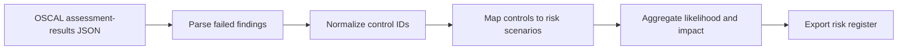

# OSCAL Risk Bridge

[](https://github.com/envokeME/oscal-risk-bridge/actions/workflows/tests.yml)

OSCAL Risk Bridge is a Python risk engineering prototype that translates OSCAL-formatted control findings into business-readable risk scenarios and risk register outputs.

The goal is to bridge a common gap in GRC automation: control assessment tools can tell us which controls failed, but risk managers still have to explain what those failures mean in operational and leadership terms.

## Why This Project Exists

Most automation in GRC focuses on evidence collection, control status, and compliance reporting. This project explores the layer above that:

- What risk does a failed control actually create?
- How do multiple failed controls combine into a meaningful risk scenario?
- How can technical assessment findings become language a risk owner can act on?

This is not intended to replace OSCAL, FAIR, NIST 800-30, or an enterprise risk methodology. It is a small bridge between control assessment results and risk identification.

## What It Does



Given sample OSCAL assessment findings such as failed `AC-2`, `IA-2`, `AU-6`, `SC-7`, and `CM-6` controls, the tool produces risk register entries like:

| Scenario | Domain | Rating | Why it matters |
| --- | --- | --- | --- |
| Unauthorized privileged access | Identity and Access Risk | Critical | Account lifecycle and MFA failures create a plausible path for misuse of privileged accounts. |
| External attack surface exposure | Infrastructure Risk | Critical | Boundary protection gaps and configuration drift increase exposure to production systems. |
| Delayed detection of suspicious activity | Security Operations Risk | Moderate | Inconsistent audit review reduces confidence that suspicious activity will be escalated in time. |

## Demo

Run the local demo:

```powershell
git clone https://github.com/envokeME/oscal-risk-bridge.git
cd oscal-risk-bridge

py -m venv .venv
.\.venv\Scripts\Activate.ps1
py -m pip install -e .

oscal-risk-bridge `
  --findings examples/oscal-assessment-results.json `
  --mapping mappings/risk-scenarios.json `
  --out demo-output/risk-register.csv `
  --json-out demo-output/risk-register.json `
  --markdown-out demo-output/risk-register.md
```

Expected result:

```text
Parsed 5 OSCAL findings.
Generated 3 risk register entries.
Wrote CSV: demo-output\risk-register.csv
Wrote JSON: demo-output\risk-register.json
Wrote Markdown: demo-output\risk-register.md
```

If `py` is not available, use `python` instead.

## Outputs

The tool exports the same risk register in three formats:

- CSV for spreadsheet review
- JSON for downstream automation
- Markdown for GitHub, documentation, and executive-readable summaries

Sample outputs:

- [Sample CSV risk register](examples/risk-register.sample.csv)
- [Sample JSON risk register](examples/risk-register.sample.json)
- [Sample Markdown risk report](examples/risk-register.sample.md)

## Project Structure

```text
src/oscal_risk_bridge/     Python package and CLI
examples/                  Sample OSCAL input and generated outputs
mappings/                  Control-to-risk-scenario mapping data
docs/                      Architecture notes and portfolio narrative
aws/                       Optional S3/Lambda deployment pattern
tests/                     Unit tests
```

## Design Choices

The project keeps the subjective risk translation layer in data instead of hiding it in code.

`mappings/risk-scenarios.json` defines:

- Scenario title and risk domain
- Business-readable risk statement template
- Owner and response recommendation
- Control mappings and weights
- Base likelihood and impact

The scoring model is intentionally simple and explainable:

1. Parse failed or open OSCAL findings.
2. Normalize control IDs such as `AC-2`, `IA-2`, or `SC-7`.
3. Match failed controls to mapped risk scenarios.
4. Aggregate evidence by scenario.
5. Adjust likelihood and impact based on control weight and severity.
6. Export a risk register a human risk owner can review.

## AWS Pattern

The project runs locally without AWS. The optional AWS pattern is:

```text
S3 upload -> Lambda -> OSCAL Risk Bridge -> S3 risk register outputs
```

See [aws/README.md](aws/README.md) for the deployment concept.

## Tests

```powershell
py -m unittest discover -s tests -p "test_*.py"
```

## Roadmap

- Support more OSCAL assessment-results fields
- Add scenario confidence scoring
- Add richer risk treatment recommendations
- Add optional API endpoint for uploading findings
- Add an HTML dashboard for browsing generated risk scenarios

